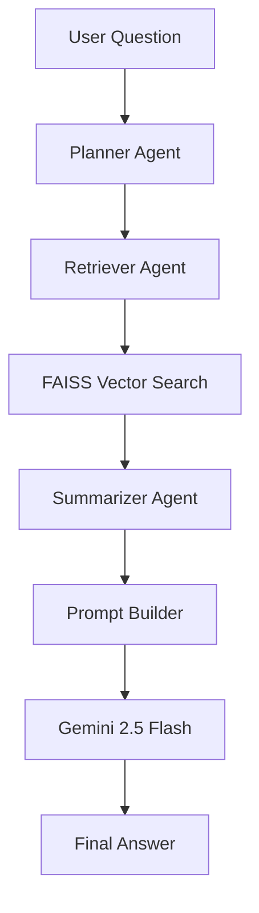

# AI Research Assistant

An intelligent multi-source Research Assistant built with Flask, Retrieval-Augmented Generation (RAG), FAISS Vector Search, Agentic AI workflows, and Google Gemini.

The system allows users to upload PDFs, CSV files, and website content, convert them into searchable knowledge bases, retrieve relevant context using semantic search, and generate accurate answers using Large Language Models.

---
## Live Demo

👉 https://huggingface.co/spaces/sid3305/AI-Research-Assistant

Experience a fully deployed Agentic RAG application capable of answering questions over PDFs, CSV datasets, and website content using semantic retrieval and Google Gemini.

---

## Highlights

* Agentic RAG architecture using Planner, Retriever, and Summarizer agents
* PDF, CSV, and Website knowledge ingestion
* Semantic search powered by Sentence Transformers
* FAISS vector database retrieval
* Google Gemini 2.5 Flash integration
* Session-aware conversational memory
* Modern chat-based user interface
* Modular Flask architecture
* Automated testing suite

---

## Chat Interface


---

## Features

### Multi-Source Knowledge Ingestion

* Upload PDF documents
* Upload CSV datasets
* Extract content from websites through web scraping
* Automatic text preprocessing and chunking

### Retrieval-Augmented Generation (RAG)

* Semantic search using embeddings
* FAISS vector database retrieval
* Context-aware answer generation
* Reduced hallucinations through document grounding

### Agentic Workflow

The assistant uses a multi-agent architecture:

#### Planner Agent

* Analyzes the user query
* Determines retrieval strategy

#### Retriever Agent

* Performs semantic search
* Retrieves the most relevant context

#### Summarizer Agent

* Consolidates retrieved evidence
* Produces contextual knowledge for answer generation

### Large Language Model Integration

* Google Gemini 2.5 Flash
* Context-enriched prompting
* Research-focused responses

### Session Management

* Conversation memory
* Context preservation across interactions
* Stateful user experience

### Modern User Interface

* Chat-style interface
* Document upload support
* Website ingestion support
* Responsive design
* Real-time interaction

### Testing

Comprehensive tests covering:

* Embedding generation
* Vector search
* Retrieval pipeline
* Agent workflow
* Prompt generation
* Gemini integration

---

## System Architecture



---

## Screenshots

### PDF Research

Upload PDF documents and perform document-grounded question answering.


### CSV Analysis

Upload CSV datasets and query structured information using natural language.


### Website Research

Scrape website content and interact with it through the research assistant.


---

## Technology Stack

### Backend

* Flask
* Flask-SQLAlchemy

### Artificial Intelligence

* Google Gemini 2.5 Flash
* Sentence Transformers
* all-MiniLM-L6-v2

### Retrieval

* FAISS
* Semantic Search

### Data Processing

* pdfplumber
* pandas
* BeautifulSoup4
* requests

### Frontend

* HTML
* CSS
* JavaScript
* Fetch API

### Database

* SQLite
* SQLAlchemy ORM

---

## Project Structure

```text
app/
├── blueprints/
│   ├── upload_routes.py
│   └── chat_routes.py
│
├── services/
│   ├── document_service.py
│   ├── session_service.py
│   ├── rag_service.py
│   ├── embedding_service.py
│   ├── gemini_client.py
│   ├── prompt_builder.py
│   ├── vector_store.py
│   └── agents/
│       ├── planner_agent.py
│       ├── retriever_agent.py
│       └── summarizer_agent.py
│
├── utils/
│   ├── pdf_processor.py
│   ├── csv_processor.py
│   ├── web_scraper.py
│   ├── chunk_processor.py
│   ├── faiss_manager.py
│   └── logger.py
│
├── templates/
├── static/
├── config/
├── models/
└── __init__.py

tests/
uploads/
vector_db/
run.py
requirements.txt
README.md
```

---

## Installation

### Clone Repository

```bash
git clone https://github.com/YOUR_USERNAME/ai-research-assistant.git

cd ai-research-assistant
```

### Create Virtual Environment

Windows

```bash
python -m venv venv
venv\Scripts\activate
```

Linux / macOS

```bash
python3 -m venv venv
source venv/bin/activate
```

### Install Dependencies

```bash
pip install -r requirements.txt
```

### Configure Environment Variables

Create a `.env` file in the project root:

```env
GEMINI_API_KEY=your_gemini_api_key
SECRET_KEY=your_secret_key
```

### Run the Application

```bash
python run.py
```

Open:

```text
http://127.0.0.1:5000
```

---

## Usage

### PDF Research

1. Upload a PDF document
2. The document is processed and chunked
3. Embeddings are generated
4. FAISS index is created
5. Ask questions about the document

### CSV Analysis

1. Upload a CSV dataset
2. Data is transformed into searchable chunks
3. Embeddings are generated
4. Ask questions about the dataset using natural language

### Website Research

1. Enter a website URL
2. Content is scraped and processed
3. Embeddings are generated
4. Ask questions about the website content

---

## Example Queries

### PDF

* Summarize this document
* What are the key findings?
* Explain chapter 3
* What technologies are discussed?

### CSV

* What columns exist in the dataset?
* How many rows are present?
* Show sample records
* Summarize the dataset

### Website

* What is this website about?
* Summarize the content
* Extract the key information
* What services are mentioned?

---

## Testing

Run all tests:

```bash
pytest
```

Run a specific test:

```bash
pytest tests/test_rag_service.py
```

---

## Future Improvements

* Multi-document retrieval
* Persistent vector database storage
* User authentication
* Chat history persistence
* Citation generation
* Source highlighting
* Streaming responses
* Docker deployment
* Cloud vector databases
* Multi-LLM support (Gemini, Groq, OpenAI)

---

## Learning Outcomes

This project demonstrates practical experience with:

* Retrieval-Augmented Generation (RAG)
* Agentic AI Systems
* Semantic Search
* Vector Databases
* FAISS
* Prompt Engineering
* Flask Backend Development
* REST APIs
* Session Management
* Large Language Model Integration
* Software Testing
* AI Application Deployment

---

## Author

**Siddhi Bordia**

AI Research Assistant — Agentic RAG System built with Flask, FAISS, Sentence Transformers, and Google Gemini.

---

## License

This project is released for educational and portfolio purposes.
